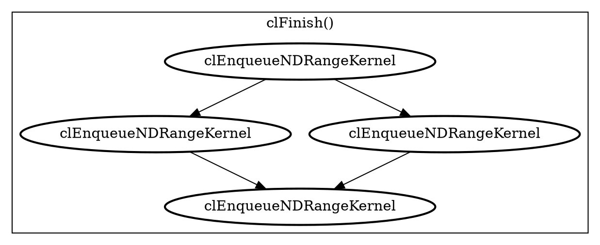
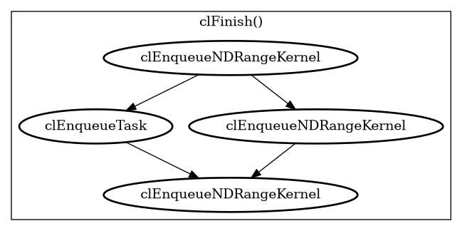

# CLVizulayer

[](https://github.com/EwanC/CLVizulayer/actions/workflows/build_test.yml)

OpenCL [layer](https://github.com/KhronosGroup/OpenCL-ICD-Loader?tab=readme-ov-file#about-layers)
that creates a [DOT](https://graphviz.org/doc/info/lang.html) file
representing the graph of commands enqueued to the device. Edges represent
happens-before dependencies between commands following the constraints in the
[OpenCL execution model](https://registry.khronos.org/OpenCL/specs/3.0-unified/html/OpenCL_API.html#_execution_model).
These are expressed via `cl_event` wait-list parameters, in-order command-queues,
and barrier commands. Note that dependencies resulting from the presence of
program scope variables are not visible to the layer, and therefore not
represented.

The [samples](samples) directory exhibits rendered DOT files captured using the
layer for key OpenCL applications like Llama.cpp, Leela Chess Zero, and OpenCV.
A smaller example is the following diamond dependency sequence:

```c
cl_event Events[3];
clEnqueueNDRangeKernel(OutOfOrderQueue, Kernel, 1, nullptr, GlobalSize, nullptr
                       0, nullptr, &Events[0]);

clEnqueueNDRangeKernel(OutOfOrderQueue, Kernel, 1, nullptr, GlobalSize, nullptr
                       1, &Events[0], &Events[1]);

clEnqueueNDRangeKernel(OutOfOrderQueue, Kernel, 1, nullptr, GlobalSize, nullptr
                       1, &Events[0], &Events[2]);

cl_event LeafDeps[2] = {Events[1], Events[2]};
clEnqueueNDRangeKernel(OutOfOrderQueue, Kernel, 1, nullptr, GlobalSize, nullptr
                       2, LeafDeps, nullptr);

clFinish(OutOfOrderQueue);
```

Which creates the following DOT output:



That can be rendered as: 

*For more information on OpenCL Layers see [The OpenCL Layers Tutorial](https://github.com/Kerilk/OpenCL-Layers-Tutorial).*

## Building

OpenCL layers are shared libraries, using the following instructions the
CLVizulayer layer will be built as `libCLVizuLayer.so`/`CLVizuLayer.dll`.

```sh
$ git clone https://github.com/EwanC/CLVizulayer
$ cmake -S CLVizulayer -B CLVizulayer/build
$ cmake --build ./CLVizulayer/build
```

The project uses `find_package(OpenCLHeaders)` and  `find_package(OpenCLICDLoader)`
to detect installations of the [OpenCL-Headers](https://github.com/KhronosGroup/OpenCL-Headers)
and [OpenCL-ICD-Loader](https://github.com/KhronosGroup/OpenCL-ICD-Loader) to
build against.

Search paths to these can be passed with `CMAKE_INSTALL_PREFIX`:

```sh
$ cmake -DCMAKE_PREFIX_PATH="/chosen/install/prefix/of/headers;/chosen/install/prefix/of/loader"
```

If these packages are not detected then CMake will download and build the
`main` branch of these repositories using `FetchContent` as part of the build.

### CMake Variables

Additional project defined CMake variables

| Name           | Description                            | Default   |
| -------------- | -------------------------------------- | --------- |
| `VIZ_DEBUG`    | Layer debug printing to stdout. (Bool) | `OFF`     |

## Running

To use the layer, set the `OPENCL_LAYERS` environment variable to the path to the
`CLVizuLayer` shared library. Note that a recent
[Khronos ICD](https://github.com/KhronosGroup/OpenCL-ICD-Loader) or
[ocl-icd](https://github.com/OCL-dev/ocl-icd) should be used to guarantee ICD
layer support. Old versions of `ocl-icd` may be installed on your system without
this feature. To work around this on Linux set `LD_PRELOAD` to the path
of a latest `libOpenCL.so` ICD.

The layer produces a dot file in the current directory named as
`clviz_YYYY-MM-DD_HH:MM:SS.dot`, but the filename can be overridden with the
`VIZ_DOT_FILE` environment variable.

These files can be rendered using the [dot tool](https://graphviz.org/doc/info/command.html)
from Graphviz or the `graph-easy` tool which has ASCII output by default.

```sh
$ sudo apt install libgraph-easy-perl
$ sudo apt install graphviz
```

## Extension

Tracing the device commands at the application level can be too noisy for
non-trivial applications. To give users finer grained control over what
is captured in the DOT graph the [cl_ext_dot_print](doc/cl_ext_dot_print)
extension has been defined.

This allows users to modify their application to mark what queues they
want to capture and for what commands. This extension is reported when
the `VIZ_EXT` environment variable is set, and it will ignore any
path set in `VIZ_DOT_FILE` in favor of the path passed in the extension
API.

### Environment Variables

These environment variables can be set to configure the DOT file output.
For variables marked Bool, `0` is OFF and a non-zero value is ON.

| Name           | Description                                         | Default |
| -------------- | --------------------------------------------------- | ------- |
| `VIZ_DOT_FILE` | Path to dot file to create.                         |  Empty  |
| `VIZ_COLOR`    | Use color in DOT file to distinguish queues. (Bool) | `0`     |
| `VIZ_VERBOSE`  | Enable verbose output. (Bool)                       | `0`     |
| `VIZ_EXT`      | Enable [extension behavior](#extension). (Bool)     | `0`     |


## Tests

The [test](test) directory contains [LLVM lit tests](https://llvm.org/docs/CommandGuide/lit.html),
for unit testing the DOT output of the layer. These compile small OpenCL
applications that are run with the layer, and the output dot file verified
with [FileCheck](https://llvm.org/docs/CommandGuide/FileCheck.html) against the
expected results.

These tests are run via the `check` build target, which is available if
CMake can detect the following dependencies during configuration:

* Python 3
* LLVM lit and Filecheck, which can be installed using the Python `pip` package
  manager.
* OpenCL ICD-Loader which will be pulled with `FetchContent` if not discovered via
  the `CMAKE_PREFIX_PATH`.
* [clinfo](https://github.com/Oblomov/clinfo), which can be installed on Ubuntu
  with `sudo apt install clinfo`.

Note that if multiple OpenCL platforms or devices exist on the system, then the
first device on the first platform is chosen for testing.
