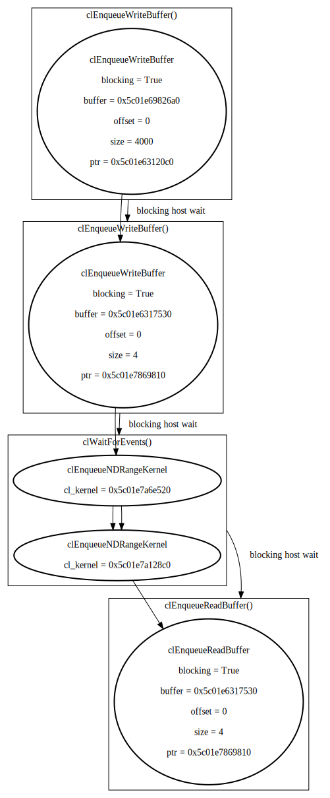

# CLBlast

[CLBlast](https://github.com/CNugteren/CLBlast) is a OpenCL BLAS
implementation. We can run the [SASUM sample](https://github.com/CNugteren/CLBlast/blob/master/samples/sasum.c)
without our layer:

```sh
$ OPENCL_LAYERS=libCLVizuLayer.so VIZ_VERBOSE=1 ./clblast_sample_sasum_c
```

This produced the DOT output in [trace.dot](trace.dot) which can be rendered as
.
