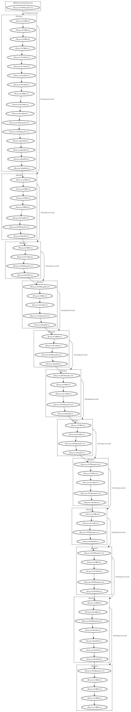

# GROMACS

GROMACS is software for molecular dynamics simulation. It has many backends
APIs that can be used for GPU acceleration, including
[OpenCL support](https://manual.gromacs.org/current/install-guide/index.html#opencl)
is depreciated but still usable.

Using an OpenCL build of GROMACS with the `grappa-1.5k-6.1M_rc0.9.tar.gz`
[grappa workload](https://zenodo.org/records/11234002) we can get a DOT
file trace with CLVizuLayer. Using a system size of 12k particles, for only 10
steps to keep the total number of OpenCL commands small:

```sh
$ cd grappa-1.5k-6.1M_rc0.9/0012
$ gmx grompp -f ../rf.mdp -c conf.gro -p topol.top -o rf.tpr
$ cd 0012
$ OPENCL_LAYERS=libCLVizuLayer.so  gmx mdrun -s rf.tpr -nobackup -noconfout -pin on -nsteps 10
```

Produces the DOT output in [trace.dot](trace.dot) which can be rendered as

