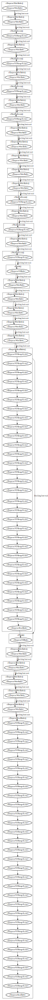

# Llama.cpp

[Llama.cpp](https://github.com/ggml-org/llama.cpp) is a AI Large
Language Model (LLM) for C/C++. It has multiple backend APIs for
GPU acceleration, including OpenCL. [The OpenCL backend was
reintroduced by Qualcomm in early 2025](https://www.qualcomm.com/developer/blog/2024/11/introducing-new-opn-cl-gpu-backend-llama-cpp-for-qualcomm-adreno-gpu).

CLVizulayer was to produce a DOT graph for the OpenCL backend by using the
[DeepSeek-R1-Distill-Qwen-1.5B-Q4_0.gguf](https://huggingface.co/ggml-org/DeepSeek-R1-Distill-Qwen-1.5B-Q4_0-GGUF)
model with a single layer `-ngl 1` and single token `-n 1` to keep the graph
size small. These parameter would be bumped to something like `-ngl 81 -n 256`
in more typical usage.

```sh
$ OPENCL_LAYERS=libCLVizuLayer.so ./bin/llama-cli -no-cnv -m $HOME/DeepSeek-R1-Distill-Qwen-1.5B-Q4_0.gguf  \
  -ngl 1 -n 1 -c 1024 --no-mmap -sm none --color   -p "What are the top 10 most beautiful countries?"
```

Produces the DOT output in [trace.dot](trace.dot) which can be rendered as

