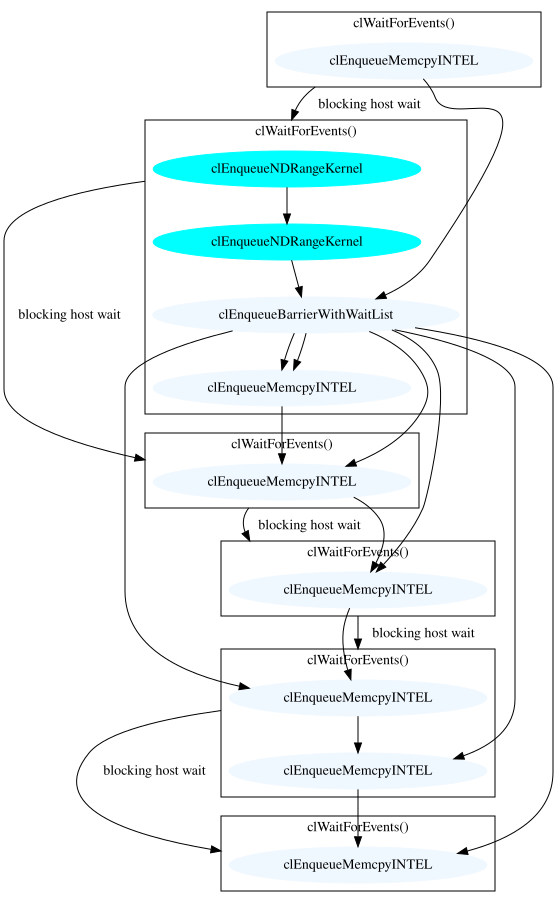

# Shamrock

[Shamrock](https://github.com/Shamrock-code/Shamrock) is a more complex SYCL application than
a simple example. Using commit `fb912782743a3a10dadc2f38b0337f2de747023f` from 05/05/2026
built against AdaptiveCPP and run against an OpenCL backend with an existing example chosen at random

```sh
$ OPENCL_LAYERS=$HOME\libCLVizuLayer.so VIZ_COLOR=1 ./shamrock --sycl-cfg 0:0 --smi --loglevel 10 --rscript ../examples/physics/run_binary_orbit.py
```

This creates [shamrock.dot](shamrock.dot) file which can be rendered as

