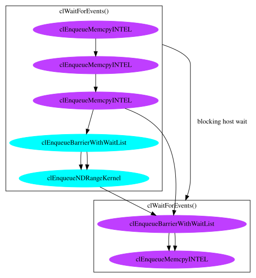
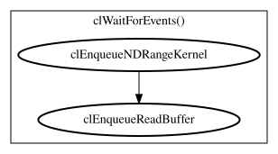

# SYCL Vector Add

The CLVizulayer tool can be used to create a graph of the OpenCL calls made from
a SYCL implementation. Using the simple [vector_add.cpp](vector_add.cpp) SYCL
application we can see the following diagrams created from popular SYCL
applications.

## AdaptiveCpp

[AdaptiveCpp](https://github.com/AdaptiveCpp/AdaptiveCpp) uses OpenCL USM/SVM/USVM
to implement SYCL buffers rather than `cl_mem` objects. This can be seen in
in the created [acpp.dot](acpp.dot) file which was created with `VIZ_COLOR=1` to
show how AdaptiveCpp splits work into two queues, one for kernels and one for
memory operations.

## DPC++

[DPC++](https://github.com/intel/llvm) uses OpenCL `cl_mem` buffers to implement SYCL
buffers. Those buffers are created with the OpenCL use host-pointer flag which
means there's no asynchronous buffer write calls captured in the [dpcpp.dot](dpcpp.dot)
file which can be rendered as 
